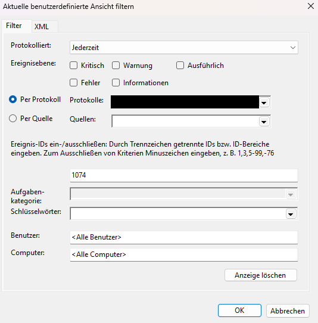
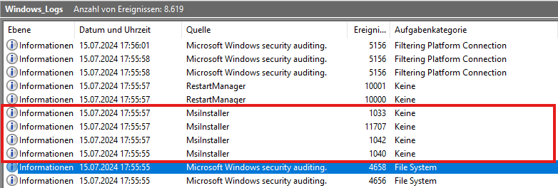

# Event-Viewing [picoCTF]

## Description
One of the employees at your company has their computer infected by malware! Turns out every time they try to switch on the computer, it shuts down right after they log in. The story given by the employee is as follows:
They installed software using an installer they downloaded online
They ran the installed software but it seemed to do nothing
Now every time they bootup and login to their computer, a black command prompt screen quickly opens and closes and their computer shuts down instantly.
See if you can find evidence for the each of these events and retrieve the flag (split into 3 pieces) from the correct logs!

## Ressources provided
- `Windows_Logs.evtx`

## Tools used
- `Windows 11 V24H2`
- `Windows Powershell`
- `Windows Event Viewer`

## Steps
- Open the `Windows_Logs.evtx` file in the `Windows Event Viewer

- I started following the lead of the **shutdown** event:
    Inside the `Windows Event Viewer` I first filtered for the event id `1074` as this id is a **User32 system event** that indicates a planned shutdown, restart or logoff.

    

    One of the logs visible was the following:

    ```bash
    - <Event xmlns="http://schemas.microsoft.com/win/2004/08/events/event">
    - <System>
    <Provider Name="User32" Guid="{b0aa8734-56f7-41cc-b2f4-de228e98b946}" EventSourceName="User32" /> 
    <EventID Qualifiers="32768">1074</EventID> 
    <Version>0</Version> 
    <Level>4</Level> 
    <Task>0</Task> 
    <Opcode>0</Opcode> 
    <Keywords>0x8080000000000000</Keywords> 
    <TimeCreated SystemTime="2024-07-15T17:01:05.3935836Z" /> 
    <EventRecordID>3801</EventRecordID> 
    <Correlation /> 
    <Execution ProcessID="432" ThreadID="3496" /> 
    <Channel>System</Channel> 
    <Computer>DESKTOP-EKVR84B</Computer> 
    <Security UserID="S-1-5-21-3576963320-1344788273-4164204335-1001" /> 
    </System>
    - <EventData>
    <Data Name="param1">C:\Windows\system32\shutdown.exe (DESKTOP-EKVR84B)</Data> 
    <Data Name="param2">DESKTOP-EKVR84B</Data> 
    <Data Name="param3">No title for this reason could be found</Data> 
    <Data Name="param4">0x800000ff</Data> 
    <Data Name="param5">shutdown</Data> 
    <Data Name="param6">dDAwbF84MWJhM2ZlOX0=</Data> 
    <Data Name="param7">DESKTOP-EKVR84B\user</Data> 
    </EventData>
    </Event>
    ```

    In the `param6` field we can see a value that strongly suggests a **Base64** encoding. Decoding this value using the `Windows PowerShell` results in the following output:

    ```bash
    PS > [System.Text.Encoding]::UTF8.GetString([System.Convert]::FromBase64String("dDAwbF84MWJhM2ZlOX0="))
    t00l_81ba3fe9}
    ```

    This looks a lot like the end part of the hidden flag. Which also fits to the statement of the CTF's description that the flag is split into three different parts.

- Filter for more events:
    
    I added another filter
    - 4657: Microsoft-Windows-Security-Auditing -> registry key is created, modified or deleted

    We knew that the malware is running at startup. To ensure this is happening the malware needs to ensure this by editing a registry entry.

    Specifically, this particular event corresponds to the described approach:

    ```bash
    - <Event xmlns="http://schemas.microsoft.com/win/2004/08/events/event">
    - <System>
    <Provider Name="Microsoft-Windows-Security-Auditing" Guid="{54849625-5478-4994-a5ba-3e3b0328c30d}" /> 
    <EventID>4657</EventID> 
    <Version>0</Version> 
    <Level>0</Level> 
    <Task>12801</Task> 
    <Opcode>0</Opcode> 
    <Keywords>0x8020000000000000</Keywords> 
    <TimeCreated SystemTime="2024-07-15T15:56:19.1031964Z" /> 
    <EventRecordID>168656</EventRecordID> 
    <Correlation /> 
    <Execution ProcessID="4" ThreadID="1084" /> 
    <Channel>Security</Channel> 
    <Computer>DESKTOP-EKVR84B</Computer> 
    <Security /> 
    </System>
    - <EventData>
    <Data Name="SubjectUserSid">S-1-5-21-3576963320-1344788273-4164204335-1001</Data> 
    <Data Name="SubjectUserName">user</Data> 
    <Data Name="SubjectDomainName">DESKTOP-EKVR84B</Data> 
    <Data Name="SubjectLogonId">0x5a428</Data> 
    <Data Name="ObjectName">\REGISTRY\MACHINE\SOFTWARE\Microsoft\Windows\CurrentVersion\Run</Data> 
    <Data Name="ObjectValueName">Immediate Shutdown (MXNfYV9wcjN0dHlfdXMzZnVsXw==)</Data> 
    <Data Name="HandleId">0x208</Data> 
    <Data Name="OperationType">%%1904</Data> 
    <Data Name="OldValueType">-</Data> 
    <Data Name="OldValue">-</Data> 
    <Data Name="NewValueType">%%1873</Data> 
    <Data Name="NewValue">C:\Program Files (x86)\Totally_Legit_Software\custom_shutdown.exe</Data> 
    <Data Name="ProcessId">0x1bd0</Data> 
    <Data Name="ProcessName">C:\Program Files (x86)\Totally_Legit_Software\Totally_Legit_Software.exe</Data> 
    </EventData>
    </Event>
    ```

    This event log shows that malware persists by writing a registry entry under the Run key. The process `Totally_Legit_Software.exe` created the entry pointing to `custom_shutdown.exe`, which ensures that the malicious shutdown occurs on every user login.

    Additionally, this event holds a value `<Data Name="ObjectValueName">Immediate Shutdown (MXNfYV9wcjN0dHlfdXMzZnVsXw==)</Data>` in the EventData section. The value `MXNfYV9wcjN0dHlfdXMzZnVsXw==` looks like to be encoded in **Base64** aswell. Decoding results in the following output:

    ```bash
    PS > [System.Text.Encoding]::UTF8.GetString([System.Convert]::FromBase64String("MXNfYV9wcjN0dHlfdXMzZnVsXw=="))
    1s_a_pr3tty_us3ful_
    ```

    This seems to be the second part of the hidden flag.

- Finally, I figured we would take a look at the installation of the malware itself. For that I just looked at the events before the time `2024-07-15T15:56:19.1031964Z`as the previous entry indicates.

    

    As you can see in the screenshot above, there are 4 events that have been logged indicating the use of an `MsiInstaller`.

    ```bash
    - <Event xmlns="http://schemas.microsoft.com/win/2004/08/events/event">
    - <System>
    <Provider Name="MsiInstaller" /> 
    <EventID Qualifiers="0">1040</EventID> 
    <Version>0</Version> 
    <Level>4</Level> 
    <Task>0</Task> 
    <Opcode>0</Opcode> 
    <Keywords>0x80000000000000</Keywords> 
    <TimeCreated SystemTime="2024-07-15T15:55:55.9707879Z" /> 
    <EventRecordID>2370</EventRecordID> 
    <Correlation /> 
    <Execution ProcessID="0" ThreadID="0" /> 
    <Channel>Application</Channel> 
    <Computer>DESKTOP-EKVR84B</Computer> 
    <Security UserID="S-1-5-21-3576963320-1344788273-4164204335-1001" /> 
    </System>
    - <EventData>
    <Data>C:\Users\user\Desktop\Totally_Legit_Software.msi</Data> 
    <Data>9004</Data> 
    <Data>(NULL)</Data> 
    <Data>(NULL)</Data> 
    <Data>(NULL)</Data> 
    <Data>(NULL)</Data> 
    <Data /> 
    </EventData>
    </Event>

    - <Event xmlns="http://schemas.microsoft.com/win/2004/08/events/event">
    - <System>
    <Provider Name="MsiInstaller" /> 
    <EventID Qualifiers="0">1033</EventID> 
    <Version>0</Version> 
    <Level>4</Level> 
    <Task>0</Task> 
    <Opcode>0</Opcode> 
    <Keywords>0x80000000000000</Keywords> 
    <TimeCreated SystemTime="2024-07-15T15:55:57.7297984Z" /> 
    <EventRecordID>2373</EventRecordID> 
    <Correlation /> 
    <Execution ProcessID="0" ThreadID="0" /> 
    <Channel>Application</Channel> 
    <Computer>DESKTOP-EKVR84B</Computer> 
    <Security UserID="S-1-5-21-3576963320-1344788273-4164204335-1001" /> 
    </System>
    - <EventData>
    <Data>Totally_Legit_Software</Data> 
    <Data>1.3.3.7</Data> 
    <Data>0</Data> 
    <Data>0</Data> 
    <Data>cGljb0NURntFdjNudF92aTN3djNyXw==</Data> 
    <Data>(NULL)</Data> 
    <Data /> 
    <Binary>7B33443343333833332D444544362D343032322D423541312D4537463337373839433339307D3030303037363533376239373032333966396130373530633431623838363466646163393030303030303030</Binary> 
    </EventData>
    </Event>
    ```

    In this event logs can see an event with the id `1040` which corresponds to the start of an **MsiInstaller** `Totally_Legit_Software.msi` and the event with id `1033` which indicates the successfully finished installation of our malware at `2024-07-15T15:55:57.7297984Z` using the downloaded installer.

    Also, the second event contains the final piece for our flag `cGljb0NURntFdjNudF92aTN3djNyXw==`. Decoded we get the following output:

    ```bash
    PS > [System.Text.Encoding]::UTF8.GetString([System.Convert]::FromBase64String("cGljb0NURntFdjNudF92aTN3djNyXw=="))
    picoCTF{Ev3nt_vi3wv3r_
    ```

- Putting the pieces together results in the complete flag.
## Solution
**Flag**: `picoCTF{Ev3nt_vi3wv3r_1s_a_pr3tty_us3ful_t00l_81ba3fe9}`
