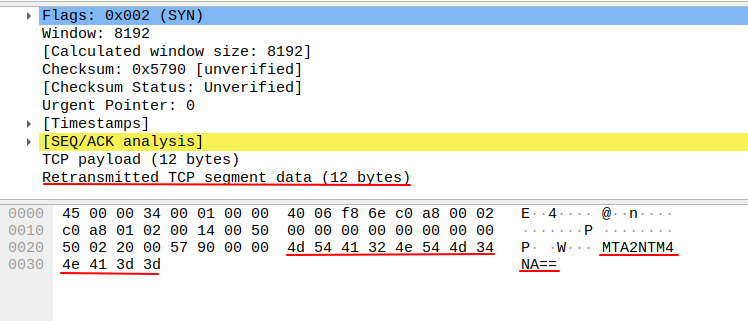
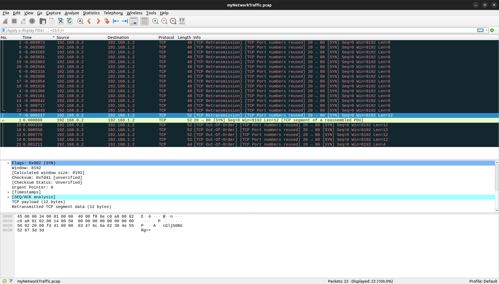

# Ph4nt0m 1ntrud3r [picoCTF]

## Description
A digital ghost has breached my defenses, and my sensitive data has been stolen! Your mission is to uncover how this phantom intruder infiltrated my system and retrieve the hidden flag.
To solve this challenge, you'll need to analyze the provided PCAP file and track down the attack method. The attacker has cleverly concealed his moves in well timely manner. Dive into the network traffic, apply the right filters and show off your forensic prowess and unmask the digital intruder!
Find the PCAP file here Network Traffic PCAP file and try to get the flag.

## Approach

1. The capture only includes **TCP traffic** — no higher-level protocols like HTTP or FTP are present.

2. A number of packets contain **base64-encoded strings** in the TCP payload.

3. These base64 strings appear to be fragments of the final flag.

4. When sorted by packet timestamp, the base64 fragments align into a valid, readable flag.

## Steps
- Analyze network traffic:
Some packets contain base64 encoding inside the TCP segment data field e.g.



- Decoding the encoded base64 strings:
```bash
echo "cGljb0NURg=="     | base64 -d  # picoCTF
echo "YmhfNHJfZA=="     | base64 -d  # bh_4r_d
echo "ezF0X3c0cw=="     | base64 -d  # {1t_w4s
echo "bnRfdGg0dA=="     | base64 -d  # nt_th4t
echo "MTA2NTM4NA=="     | base64 -d  # 1065384
echo "XzM0c3lfdA=="     | base64 -d  # _34sy_t
echo "fQ=="             | base64 -d  # }
```
- Sort packets in **wireshark** by time:

We sort the packets by absolute time to ensure the base64 strings are arranged correctly. This reveals the correct order of the fragments.



- Combine the decoded segments:

`picoCTF{1t_w4snt_th4t_34sy_tbh_4r_d1065384}`

## Solution
**Flag**: `picoCTF{1t_w4snt_th4t_34sy_tbh_4r_d1065384}`
