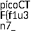

# Secret of the Polyglot [picoCTF]

## Description
In this task we were give a suspicious **pdf** file. We were asked to analyze this file and extract all the information that we can find.

## Approach

1. First, I ran `exiftools` on the file to reveal the metadata. This revealed that there was trailing data and the file type is a **png**.

2. Then, I used **ghex** to analyze the binary data of the file. 

3. Open the file as a **png**

## Steps
- Run `exiftools`:
```bash
ale@ale:~/Documents/Cybersecurity-Writeups/picoCTF/secret_of_the_polyglot$ exiftool flag2of2-final.pdf 
ExifTool Version Number         : 12.40
File Name                       : flag2of2-final.pdf
Directory                       : .
File Size                       : 3.3 KiB
File Modification Date/Time     : 2025:09:22 12:30:57+02:00
File Access Date/Time           : 2025:09:22 12:31:17+02:00
File Inode Change Date/Time     : 2025:09:22 12:31:02+02:00
File Permissions                : -rw-rw-r--
File Type                       : PNG
File Type Extension             : png
MIME Type                       : image/png
Image Width                     : 50
Image Height                    : 50
Bit Depth                       : 8
Color Type                      : RGB with Alpha
Compression                     : Deflate/Inflate
Filter                          : Adaptive
Interlace                       : Noninterlaced
Profile Name                    : ICC profile
Profile CMM Type                : Little CMS
Profile Version                 : 4.3.0
Profile Class                   : Display Device Profile
Color Space Data                : RGB
Profile Connection Space        : XYZ
Profile Date Time               : 2023:11:02 17:42:31
Profile File Signature          : acsp
Primary Platform                : Apple Computer Inc.
CMM Flags                       : Not Embedded, Independent
Device Manufacturer             : 
Device Model                    : 
Device Attributes               : Reflective, Glossy, Positive, Color
Rendering Intent                : Perceptual
Connection Space Illuminant     : 0.9642 1 0.82491
Profile Creator                 : Little CMS
Profile ID                      : 0
Profile Description             : GIMP built-in sRGB
Profile Copyright               : Public Domain
Media White Point               : 0.9642 1 0.82491
Chromatic Adaptation            : 1.04788 0.02292 -0.05022 0.02959 0.99048 -0.01707 -0.00925 0.01508 0.75168
Red Matrix Column               : 0.43604 0.22249 0.01392
Blue Matrix Column              : 0.14305 0.06061 0.71393
Green Matrix Column             : 0.38512 0.7169 0.09706
Red Tone Reproduction Curve     : (Binary data 32 bytes, use -b option to extract)
Green Tone Reproduction Curve   : (Binary data 32 bytes, use -b option to extract)
Blue Tone Reproduction Curve    : (Binary data 32 bytes, use -b option to extract)
Chromaticity Channels           : 3
Chromaticity Colorant           : Unknown (0)
Chromaticity Channel 1          : 0.64 0.33002
Chromaticity Channel 2          : 0.3 0.60001
Chromaticity Channel 3          : 0.15001 0.06
Device Mfg Desc                 : GIMP
Device Model Desc               : sRGB
Pixels Per Unit X               : 11811
Pixels Per Unit Y               : 11811
Pixel Units                     : meters
Modify Date                     : 2023:11:02 17:57:06
Comment                         : Created with GIMP
Warning                         : [minor] Trailer data after PNG IEND chunk
Image Size                      : 50x50
Megapixels                      : 0.003

```

- Open the file as png:
```bash
mv flag2of2-final.pdf flag2of2-final.png
ale@ale:~/Documents/Cybersecurity-Writeups/picoCTF/secret_of_the_polyglot$ xdg-open $"flag2of2-final.png"
```



This revealed the first part of the flag `picoCTF{f1u3n7_`

-Open the original pdf file:


This revealed the second part of the flag `1n_pn9_&_pdf_2a6a1ea8}`
## Solution
**Flag**: `picoCTF{f1u3n7_1n_pn9_&_pdf_2a6a1ea8}`
