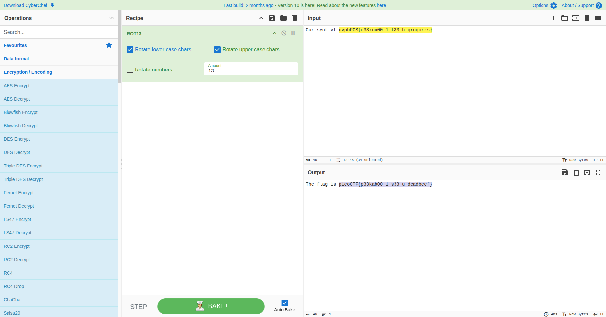

# Wireshark doo dooo do doo... [picoCTF]

## Description
Can you find the flag? shark1.pcapng.

## Ressources provided
- `shark1.pcapng`

## Tools used
- Wireshark
- [CyberChef](https://gchq.github.io/CyberChef/)


## Steps

- Open the `shark1.pcapng` file in wireshark

- Filter for HTTP traffic:

    I suspected the flag might be hidden in plaintext. However that was not specific enough as it did not narrow down enough.

- Filter using the `data-text-lines` filter:
    
    That filter is used to match packets that contain text-based lines of data.

    

    In one of the packets i found a string that looked a lot like the flag we were searching for but encoded in some form.

    `cvpbPGS{c33xno00_1_f33_h_qrnqorrs}`

- Analyze the encoded string:

    The ecoded string seemed to share the same structure as the flag structure typically used in picoCTF challenges. That meant that we know the first seven letters of the flag.

    ```
    c -> p
    v -> i 
    p -> c 
    b -> o 
    P -> C
    G -> T
    S -> F
    ```

    That basically showed that the flag was encoded using a roation by 13.

- Decode the encoded string:
    
    For that I used the tool [CyberChef](https://gchq.github.io/CyberChef/)

    
    
## Solution
**Flag**: `picoCTF{p33kab00_1_s33_u_deadbeef}`
