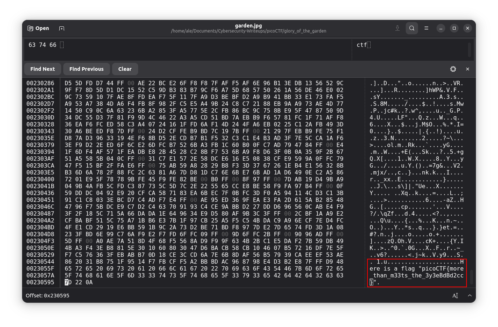

# Glory of the Garden [picoCTF]

## Description
In this task we get a `.jpg` file that supposedly contained a hidden flag. The task was to analyze the file and recover the flag.

## Approach
1. First, I opened the file with the standard image viewer of Ubuntu. The picture looked normal, with no obvious clues.

2. I suspected that the flag might be hidden in the file's raw data rather than the visible image.

3. To investigate further, I used the hex editor `ghex`to manually inspect the files contents.

## Steps
- Opened the `garden.jpg`file in **ghex**:
```bash
ghex garden.jpg
```
- Searched for `picoCTF` in **ghex** since the flag contains this string.


## Solution
**Flag**: `picoCTF{more_than_m33ts_the_3y3eBdBd2cc}`
